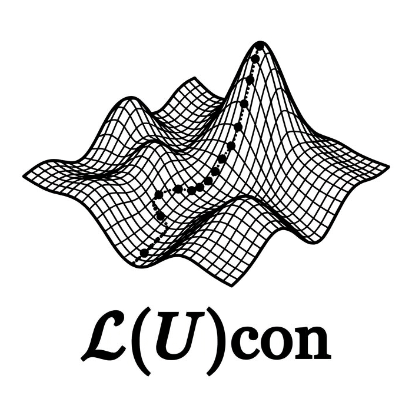

# Lucon

[](https://github.com/toschaefer/Lucon.jl/actions/workflows/CI.yml?query=branch%3Amain)

Lucon (**L**oss optimization under **U**nitary **CON**straint) optimizes loss functions mapping a unitary matrix onto a number. A conjugate-gradient algorithm is used following the work by [T. Abrudan et al., Signal Processing 89 (2009) 1704–1714](https://dx.doi.org/10.1016/j.sigpro.2009.03.015).

Applications range from signal processing and machine learning to orbital rotations (e.g. orbital localization) in quantum chemistry and materials science. The main motivation for Lucon.jl are orbital localizations for calculations in materials physics and quantum chemistry, see [How to cite?](#how-to-cite) below.

<p align="center">
  
</p>

Lucon is designed in a way that users can implement arbitrary loss functionals with little effort. As a template the [BrockettLoss.jl](examples/BrockettLoss.jl) functional can be used (see example below).

To provide a very simple and illustrative example of Lucon's potential use cases, consider the following loss functional that can be used to diagonalize a hermitian matrix.
```math
L(U) = \text{tr}(U^\dagger H U N)
```
Here, $H$ is a hermitian matrix (to be diagonalized) and $N$ is a diagonal matrix with distinct entries in ascending order, $N_{nm} = n\delta_{nm}$. Lucon finds the optimal $U$ which maximizes the loss functional. For this particular choice of $L(U)$ (also known as [Brockett criterion](https://doi.org/10.1016/0024-3795(91)90021-N)), the optimal unitary matrix is the one that diagonalizes $H$. The ascending entries of $N$ are what makes that maximum unique: since $L(U) = \sum_n n\,(U^\dagger H U)_{nn}$, the largest weight has to meet the largest diagonal element, so $L$ is maximal when $U^\dagger H U$ is diagonal with the eigenvalues in ascending order.

## Install

In the Julia REPL, simply run the following commands:
```julia
using Pkg
Pkg.add("Lucon")
```


## Usage

In order to optimize a loss functional $L(U)$, Lucon needs the Euclidean derivative $\Gamma_{ij} = \partial L / \partial u^*_{ij}$, which for the above example (Brockett criterion) simply reads $\Gamma = \partial L /\partial U^\dagger = H U N$. You pass it as any callable `gradient(U, calc_loss)` returning the tuple `(Γ, loss)`. The value of the loss is only read when `calc_loss` is `true`, so its computation may be skipped otherwise. Nothing has to be sub-typed and no method of Lucon has to be overloaded, which means that `optimize` can be called with `do` syntax:

```julia
import Lucon
using LinearAlgebra

H = Hermitian(rand(6,6) + im*rand(6,6)) # the hermitian matrix to be diagonalized
U = Matrix{ComplexF64}(I, 6, 6)         # the initial unitary matrix
N = Diagonal(float.(1:size(H,1)))       # the N matrix is a diagonal matrix with entries N_nn = n

result = Lucon.optimize(U; max_taylor_degree=2, maximize=true) do U, calc_loss
    Γ = H*U*N # Euclidean derivative has same type and dimension as U
    # L = tr(U'HUN) = tr(U'Γ) is the Frobenius product of U and Γ, which dot
    # evaluates without ever forming the matrix product U'Γ
    (Γ, calc_loss ? real(dot(U, Γ)) : 0.0)
end
```
The `do` block is an ordinary anonymous function, passed to `optimize` as its first argument, and `result.U` is the matrix that diagonalizes `H`:
```julia
julia> result.U' * H * result.U ≈ Diagonal(eigvals(H)) # eigenvalues in ascending order
true
```

When the functional has to carry precomputed quantities, give them to a struct and make the struct callable. Store them with a concrete type and build them once, since the functional is evaluated once per iteration and once for every sampling point of the line search, and therefore dominates the run time. Annotate the argument as `U::AbstractMatrix` rather than `Matrix`, so that `U` may also live on a GPU:

```julia
struct LossFunction{TH<:Hermitian, TN<:Diagonal}
    H::TH
    N::TN
end

LossFunction(H::Hermitian) = LossFunction(H, Diagonal(float.(1:size(H,1))))

# the loss tr(U'HUN) = tr(U'Γ) is the Frobenius product of U and Γ, which dot evaluates
# without ever forming the matrix product U'Γ
function euclidean_gradient(L::LossFunction, U::AbstractMatrix, calc_loss::Bool)
    Γ = L.H*U*L.N
    (Γ, calc_loss ? real(dot(U, Γ)) : 0.0)
end

# from here on L(U, calc_loss) calls euclidean_gradient(L, U, calc_loss)
(L::LossFunction)(U::AbstractMatrix, calc_loss::Bool) = euclidean_gradient(L, U, calc_loss)

result = Lucon.optimize(LossFunction(H), U; max_taylor_degree=2, maximize=true)
```
The last line is the one piece of syntax worth reading twice. A method whose *name* is an argument, `(L::LossFunction)(U, calc_loss)`, does not define a function called `LossFunction`; it defines what happens when an *instance* of that type is called like a function. Such a struct is a closure you can name: the fields are the captured data, this method is the body. That is why `optimize` needs neither a sub-typed argument nor an overloaded method, and why the `do` block above and the loss function here are interchangeable.
The full example and its usage can be found in the example file [BrockettLoss.jl](examples/BrockettLoss.jl) and in the test file [runtests.jl](test/runtests.jl).
Both can be used as a **template** to implement arbitrary loss functionals.

`optimize` returns a `Lucon.Result`:
```julia
julia> result
Lucon.Result
  status:        converged
  iterations:    79
  loss:          9.5330162221636101e+00
  max_gradient:  4.030e-09
  U:             6×6 Matrix{ComplexF64}

julia> Lucon.converged(result)
true
```
Its fields are `result.U`, `result.loss`, `result.max_gradient`, `result.iterations` and `result.status`. `loss` and `max_gradient` are always `Float64`, whatever the element type of `U`. `status` is one of `:converged`, `:max_iter`, `:callback`, or `:line_search` if the line search found no positive step size.

The full signature reads
```julia
result = Lucon.optimize(
    gradient,
    U;
    max_taylor_degree,
    maximize=false,
    min_iter=0,
    max_iter=typemax(Int),
    max_gradient_tolerance=1e-8,
    solver_algo=:CGPR,
    line_search_samples=5,
    callback=nothing
)
```
* `max_taylor_degree` is the order $q$ of the loss functional, i.e. the highest power of $t$ appearing in the Taylor expansion of $L(U + tZ)$. It sets the width $T_\mu = 2\pi/(q\,|\omega_\text{max}|)$ of the window the line search scans, where $\omega_\text{max}$ is the largest absolute eigenvalue of the ascent direction. It has no default because it is a property of the functional. For the Brockett criterion above $L(U+tZ)$ carries one factor $U^\dagger$ and one factor $U$, is therefore quadratic in $t$, and $q=2$.
* `maximize` maximizes $L(U)$ instead of minimizing it.
* `min_iter` suppresses the convergence signal before this number of iterations is reached.
* `max_iter` limits the number of rotations of `U` and is unlimited by default.
* `max_gradient_tolerance` is the threshold below which the largest absolute element of the Riemannian gradient $G$ has to drop for convergence. This maximum norm is used instead of the Frobenius norm because it does not grow with the size of the system: if a supersystem is built from $M$ non-interacting copies of a subsystem, then $\max_{ij}|G_{ij}|$ is unchanged while $\|G\|_F$ grows as $\sqrt{M}$. One and the same `max_gradient_tolerance` therefore converges subsystem and supersystem to the same accuracy per degree of freedom.
* `solver_algo` selects the solver, currently only the conjugate-gradient Polak-Ribière algorithm `:CGPR`.
* `line_search_samples` is the number $P$ of equidistant points $\mu = \mu_\text{step}, 2\mu_\text{step}, \dots$ with $\mu_\text{step} = T_\mu/P$ at which the line search samples the derivative of $L$ along the geodesic, each costing one gradient evaluation. A polynomial of degree $P$ is fitted through them, so $P$ must be at least 3 to resolve one oscillation of the derivative; the window is chosen such that 3 to 5 suffice for any $q$.
* `callback` reports the progress of the iteration, see [Output](#output) below.

The element type of the initial `U` selects the group that is optimized over, the orthogonal group for a real and the unitary group for a complex element type.

## Output

`optimize` prints nothing on its own. Progress is reported through `callback`, a function which is called once per iteration with the named tuple `(; iteration, max_gradient, loss, U)` and which stops the iteration when it returns `true`. It is called before the break conditions are tested and therefore also sees the iterate the iteration stops on, so that `max_iter=3` yields four calls. To print a convergence trace, pass the ready-made `Lucon.PrintTrace`:
```julia
result = Lucon.optimize(
    gradient,
    U;
    max_taylor_degree=2,
    callback=Lucon.PrintTrace() # or Lucon.PrintTrace(stderr)
)
```
```
 #iter   max|grad|            loss-function        time [s]
     1   1.255e+02   3.7242456619410751e+02               -
     2   1.242e+02   3.1304466586705155e+04       3.223e+00
     3   9.906e+01   4.2986426663711449e+04       2.475e-01
     4   5.966e+01   5.1104471129939884e+04       1.778e-01
```
The last column is the wall clock time one iteration took. The first line carries no time because the callback is called from within the iteration it would measure, and the second line usually still contains the time it took to compile the line search.

The callback is equally the place to record a convergence history, to checkpoint `U`, or to stop on a criterion of your own:
```julia
history = Float64[]
record_loss(state) = (push!(history, state.loss); state.iteration ≥ 100)

result = Lucon.optimize(
    gradient,
    U;
    max_taylor_degree=2,
    callback=record_loss
)
```
A callback which stopped the iteration leaves `result.status == :callback`. The reason for which the iteration stopped is in addition emitted as a `@debug` message and can be made visible with `ENV["JULIA_DEBUG"] = "Lucon"`.

## How to cite?

Benjamin Wöckinger, Alexander Rumpf, Tobias Schäfer. *Convergence and Properties of Intrinsic Bond Orbitals in Solids*, [J. Chem. Theory Comput. 2025, 21, 20, 10515–10526](https://doi.org/10.1021/acs.jctc.5c00130)
